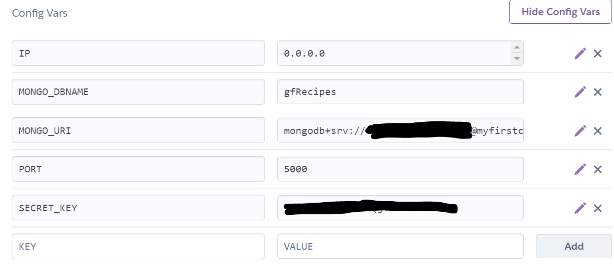

# Gluten Free Kids Website

[View live project here](http://gf-recipes-ms3.herokuapp.com/)

This website has been created for my backend development milestone project. 

The site created is a fictional recipe sharing buisness set up by a group of fictional mums, As half my family is Gluten Free I understand and can relate to the theme.

Users can register for a free account and then share recipes with other users, they can also edit or delete their recipes and if they've had enough they can delete their account.

# Table of Contents 

1. [Introduction](#Introduction)
2. [User Experience (UX)](#UX)
3. [Design](#Design)
4. [Wireframes](#Wirefames)
5. [Features](#Features)
6. [Technologies Used](#Technologies)
7. [Testing](#Testing)
8. [Deployment](#Deployment)
9. [Cloning Repository](#Cloning)
10. [Credits](#Credits)

# Introduction 

## Website Purpose :

* For users to share gluten free recipes
* Allow users to create a account
* Allow users to edit and delete recipes
* Provide information about being gluten free
* Let users know the background to the creation of the site

## Key considerations :

* All recipes must be gluten free, with clear images and instructions
* Website to be bright and colourful but still soft/easy on the eye not garish
* Images to be bright, colourful and relevant
* Layout & content to be child friendly for family to view together

[ Back to Table of Contents](#home)

# User Experience (UX) 

## First time user goals :

* Easily understand the purpose of the website
* Find info on being Gluten Free
* Register to create an account
* View recipes and search recipes

## Returning/Frequent user goals:

* View recipes and search recipes
* See new recipes added by other users
* Check out Monthly Fav recipe
* Edit/Delete recipes added
* Delete user account

## Future considerations :

* Add ratings to each recipe for user to visually identify which recipe is good
* Feedback section - area for user to feedback on site and/or recipes
* Blog for any new GF products/news or events that are relevant

[ Back to Table of Contents](#home)

# Wireframes 

*** to be uploaded ***

[ Back to Table of Contents](#home)

# Design 

## Colours:

* I used primary colours and kept it bright so it would grab the attention of children but not so bright it would be off putting for adults
* I wanted the colours to be bright and to appeal to children, to keep their interest when viewing the site with a parent

## Images:

* All non-recipe images were chosen because they were bright, followed the chosen colour scheme and had relevant content 
* Recipe images were sourced from [bbc good food](https://www.bbcgoodfood.com/)
* Non-recipe images were sourced from [unspalsh](https://unsplash.com/) and [pixabay](https://pixabay.com/)
 

## Logo: 
* I used [Jimdo](https://www.jimdo.com/) to create my company logos
* I used cartoon images of children and primary colours to keep with the theme of the site
* I used [favicon.io](https://favicon.io/) to create my favicon for the site

[ Back to Table of Contents](#home)

# Features 

## Navbar/Footer

* The navbar & footer code came from [Materialize](https://materializecss.com/) 
* The navbar features the company logo to the left and links to the other pages on the right
* The navbar switches to a sidebar on smaller screens 
Certain links are only visible for registered users
The navbar and footer logos share the same colours as the corresponding border
*The footer has links to social media. <b>Note:</b> these links are for the pages main sites as this is a fabricated company
* The footer also features a return to top button

## Homepage

* There is a brief introduction to the page followed by a prompt to register for an account
* There is a monthly fav section showcasing an exsiting recipes and prompts to user to look further
* There is a search bar which is set to search for words in recipe name, category and ingredients
* Recipe cards feature a reveal button which displays the timings, ingredients and method

## About Us Page

* Sliding Carousel featuring captions that slide into place from left/right and center
* Header has CSS glow effect
* Links to [wikipedia](https://en.wikipedia.org/wiki/Gluten-free_diet) and [Ceoliac UK](https://www.coeliac.org.uk/information-and-support/living-gluten-free/the-gluten-free-diet/about-gluten/) are provided with information about being gluten free

## Registration/Login pages

* Both pages ask for a username and password and specify how many characters are required
* The underline will be red if criteria is not met
* Flash messages let you know if username/password already exist. It doesnt specify which is incorrect for security purposes
* There is a link to Login from Registration page if you already have an account and vice versa on Login page

## Account page

* The account page features a welcome using the users name
* There is a brief introduction to you account
* There are 3 horizontal cards with the following links :
    1. The first card displays a link to add a recipe
    2. The second card displays a link to your recipes page
    3. The third card has link to delet your account. When the link is clicked this triggers a modal to confirm you wish to delete or cancel this request

## Add Recipe Page

* On this page users can add all the details for your recipe, on each item there is a prompt for the the information required
* The underline will be red if criteria is not met
* There is a 'Add Recipe' button which will add the users recipe to the Mongodb database. It will add the recipe to the my recipe page and homepage
* A flash message will let the user known their recipe has been added

## My Recipes Page

* Once the users recipes are add they will appear in this section in the same format as the cards on the homepage
* The cards have 2 floating buttons which are tooltipped to display the purpose of the button when hovered over
* The edit button takes the user to the edit page where they can amend their recipe
* The edit recipe form allows the user to save or cancel their changes
* When changes are made a flash message advises the user that the recipe has been updated
* The red button allows the user to delete their recipe from the mongodb database
* The delete button triggers a modal which offers the option to cancel or confirm the request to delete. If delete is selected the record will be deleted permanently 
    
## Logout

* The Logout link logs the user out of their account
* When clicked the user is directed to the homepage
* A flash message will be displayed to let the user know they have been logged out

## Possible Future Features
* Admin login for administrator to be able to edit/delete all content
* A 'Retype password' input on the Registration form
* Add ratings to each recipe
* Feedback section - area for user to feedback on site and/or recipes
* Blog for any new GF products/news or events that are relevant

[ Back to Table of Contents](#home)

# Technologies 

1. Languages used: HTML5, CSS3, JQuery, Javascript,  Python and Jinja

2. [GitHub](https://github.com/) 
    * My project code is stored in GitHub

3. [Git](https://gitpod.io/workspaces/) 
    * Git was used for version control, code created in GitPod was committed and pushed to GitHub

4. [unspalsh](https://unsplash.com/), [pixabay](https://pixabay.com/)
    * Used for images throughout the site

5. [Jimdo](https://www.jimdo.com/),
    * Used to create my company logos

6. [favicon.io](https://favicon.io/), 
    * Used to create my favicon

7. [w3schools](https://www.w3schools.com/) 
    * Scroll to top button in the footer was created using tutorial from w3school
    * Cut out welcome on homepage was created using tutorial from w3school
    * Glow text feature on about us page was created using tutorial from w3school 
    
8. [FontAwesome](https://fontawesome.com/) 
    * Font Awesome icons were used throughout the site

9. [MongoDB](https://www.mongodb.com/)
    * Used to create non relational database

10. [Flask](https://flask.palletsprojects.com/en/1.1.x/) 
    * Flask framework used to create app

11. [Materialize](https://materializecss.com/)
    * Used for recipe cards, register & login cards, add & edit forms, delete modals, navbar, side nav, footer, image slider 

12. [Cloudinary](https://cloudinary.com/)
    * Used to save recipe images added into MongoDB database

13. [Heroku](https://heroku.com/)
    * Used to deploy this repository

14. [Werkzeug](https://werkzeug.palletsprojects.com/en/2.0.x) 
    * Used to hash users passwords

[ Back to Table of Contents](#home)

# Testing 

Testing can be found here: [TESTING.md](TESTING.md)

[ Back to Table of Contents](#home)

# Deployment 

## This project was deployed in Heroku using the following steps:

1. Set up files the Heroku needs to run the app

    * In your development terminal type : <b>"pip3 freeze --local > requirements.txt"</b>

    This tells Heroku which applications and dependencies are required to run our app

    * In your development terminal type : <b>"echo web: python app.py > Procfile"</b>

    The Procfile is what Heroku looks for to know which file runs the app, and how to run it.

    <b>Notes:</b>
    Procfile has a capital 'P', and no file extension.
    
    The Procfile might add a blank line at the bottom, sometimes this can cause problems
    when running the app in Heroku, so delete the line and save the file.

    * Push both files to Github (git add, git commit & git push)

2. Create Heroku App
    * Go to [Heroku](https://heroku.com/) and create/log in to your dashboard
    * Click on the 'New' button on the top right hand corner and select 'Create a New App'
    * Name your App and choose your region
        * Note: app must be unique, and generally use a 'dash' or 'minus' instead of spaces, and all lowercase letters.
    * Click Create App

3. Connect to App
    * Deployment method: select 'Connect to Github'
    * make sure you Github profile is displayed search for your repository name
    * Once it finds you app click 'Connect'

4. Securely tell Heroku which variables are required
* Because the environment variables are hidden in the env.py file, Heroku won't be able to read those variables

    * Click on the 'Settings' tab for your app, and then click on 'Reveal Config Vars'
    * Make sure not to include any "quotes" for the key, or the value
    * Complete the Config Vars with the information in the env.py file :

5. Enable automatic deployment
    * Click on the 'Deploy' tab
    * In Automatic deploys section click 'Enable Automatic Deploys'
    * In Manual deploy section click 'Deploy Branch'
    * Heroku will now receive the code from GitHub, and start building the app using the required packages
    * Once it's finished, you'll get a message saying "Your app was successfully deployed."
    * Click "View" to launch your new app

The deployed site is now available and should automatically update whenever changes are pushed to the GitHub repository.  
 
When you log back into Heroku you can simply launch your app from your desktop view by selecting the 'Open App' button in the top right hand corner.

[ Back to Table of Contents](#home)

# Cloning 

### Cloning using GitHub: 
* On GitHub, navigate to the main page of the repository
* Above the list of files, click on the 'Code' button

 

* To clone the repository using HTTPS, under "Clone with HTTPS", click on the clipboard icon 
* Open Git Bash
* Change the current working directory to the location you want the clone saved
* Type git clone, and then paste the URL you copied earlier and press enter to create your local clone

 

* When it shows as done your files will be cloned to your desktop

[ Back to Table of Contents](#home)

# Credits 

## Code

* [w3schools](https://www.w3schools.com/) 
    * Scroll to top button in the footer was created using tutorial from w3school
    * Cut out welcome on homepage was created using tutorial from w3school
    * Glow text feature on about us page was created using tutorial from w3school  

* [Materialize](https://materializecss.com/)
    * Used for recipe cards, register & login cards, add & edit forms, delete modals, navbar, side nav, footer, image slider 

* Code Institute
    * Backend Development Module, Task Manager Mini Project

* Slack Community
    * Thread found on adding 404.html
    * Thread found to help with deleting the correct modal when adding 'delete modal'

## Content

* [BBC Good food](https://www.bbcgoodfood.com/)
    * All recipes were copied from BBC good food search: gluten free recipes

## Media

* Images were all sourced from [unspalsh](https://unsplash.com/), [pixabay](https://pixabay.com/) 
and [BBC Good food](https://www.bbcgoodfood.com/)

## Acknowledgements

A big thank you to the following: 

* Student support for arranging a break for me during a difficult time
* Tutor support for helping me with a few issues I had during the Backend Development Module
* My tutor, Spencer for his feedback
* My wonderfully supportive family for being understanding when I am glued to my laptop for hours on end
* The Slack community for sharing problems you come across and helpful fixes offered
* The encouragement from other students Ive connected with during my time on the course, it is a great support network 

[ Back to Table of Contents](#home)