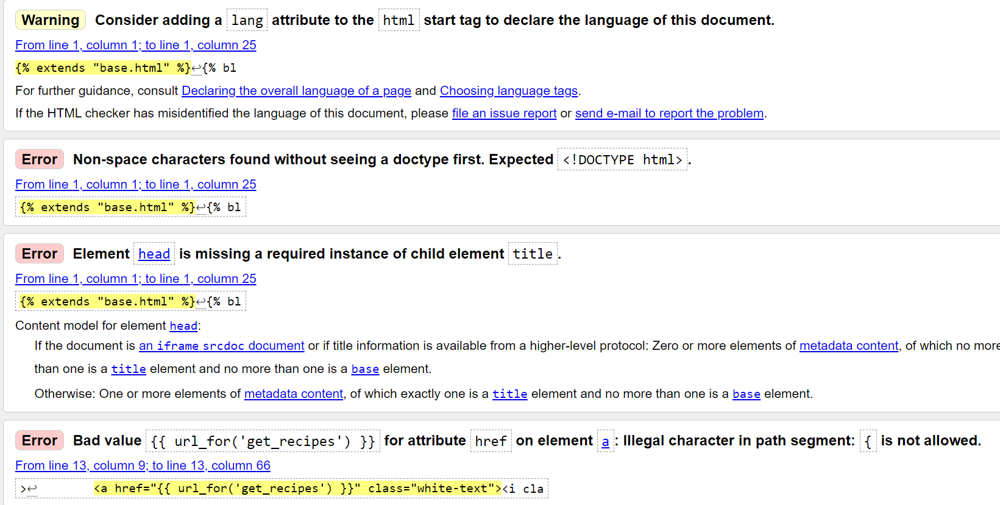
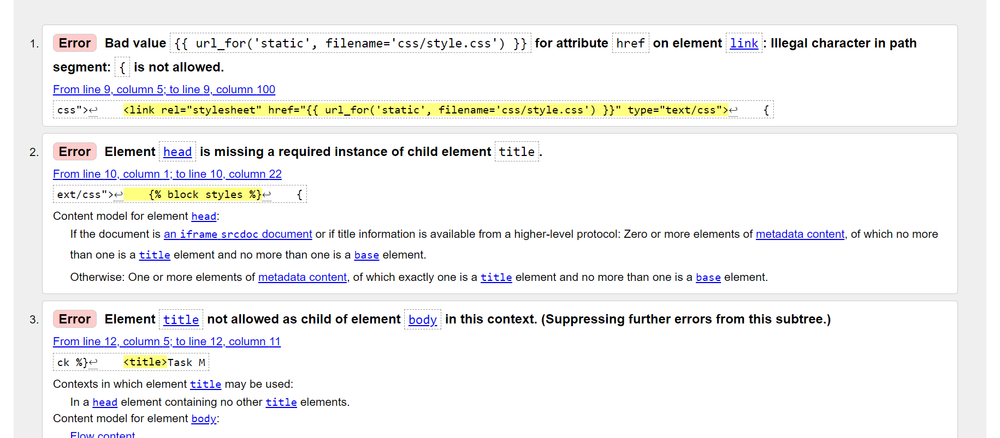
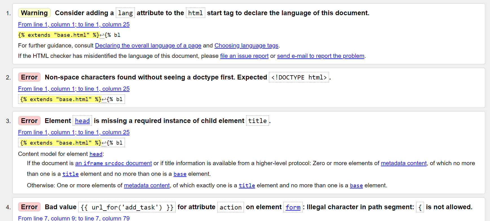
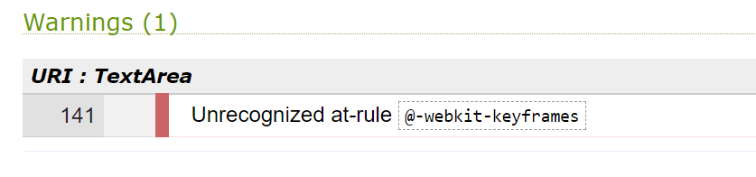
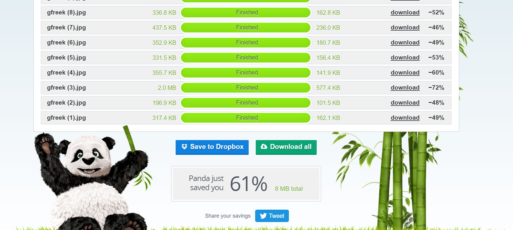
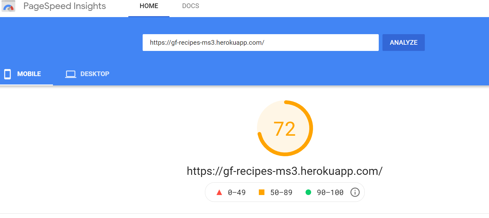
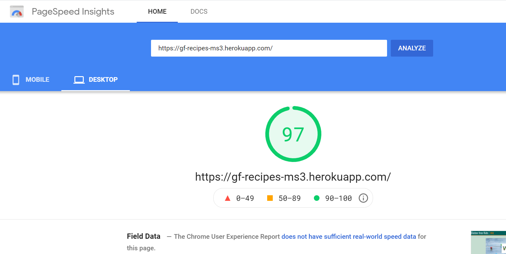

# Testing

# Table of Contents 
1. [Validation Services](#validation)
2. [Errors/Warnings HTML](#html)
3. [Errors/Warnings CSS](#css)
4. [Errors/Warnings JS Hint](#js)
5. [Errors/Warnings PEP8](#pep8)
6. [Speed Test](#speed)
7. [Testing User Experience (UX)](#ux)
8. [Manual Testing](#manual)

# Validation 

* [W3C Markup Validation Service](https://validator.w3.org/) - Used to validate html
    * As there are so many reports please find all the results [Here](static/images/testing/Html)

* [W3C CSS Validation Service](https://jigsaw.w3.org/css-validator/) - Used to validate CSS
    * style.css: [view report](static/images/testing/CSS.pdf)

* [JS Hint](https://jshint.com/) - Used to validate JavaScript
    * hmpg.js: [view report](static/images/testing/JSHint.pdf)

* [PEP8 Online Service](http://pep8online.com/) - Used to validate CSS
    * style.css: [view report](static/images/testing/PEP8.pdf)

[Back to Testing](TESTING.md)

# Errors/Warnings HTML 

There were a number of issues raised with the html checker.

These include:

The errors and warnings in the reports appeared to be because of using a base template and jinja templating. I  checked with my mentor who said errors needed to be resolved but I struggled to find a way to get around these errors so I decided to run a few pages from the mini project through the html checker to see if the same issues came up to try and work out how to resolve them.

* HTML check for 'Mini Project' - add task html](static/i

* Mini Project' - add task html

For this reason I have left these errors/warnings unresolved as I am satisfied that the only remaining errors/warnings are in connected with Jinga templating.

[Back to Testing](TESTING.md)

# Errors/Warnings CSS 

My CSS was free of errors.

I had the following warning:

As this was part of the W3Schools tutorial and it was a warning as opposed to an error I have left this in place.

[Back to Testing](TESTING.md)

# Errors/Warnings JS Hint 

My Javascript was free of errors.

I had the following warning:

As this was part of the W3Schools tutorial and it was a warning as opposed to an error I have left this in place.

# Errors/Warnings PEP8 

PEP8 showed a number of errors with length, white space and indentation. 

These have all been resolved.

[Back to Testing](TESTING.md)

# Speed Test 

I used [TinyPNG](https://tinypng.com/) to reduce the size of my images to help with loading speed

I tested the website speed for mobile and desktop and recorded the results

Mobile: 

Desktop:

[Back to Testing](TESTING.md)

# Testing User Experience (UX) 

## First time user goals :

* Easily understand the purpose of the website
    * The purpose of the website is clear from the title and opening welcome statement on the homepage
    * The purpose/background to how the site came about is explained further on the about us page  
* Find info on being Gluten Free
    * There are links to external resources on the about us page 
* Register to create an account
    * Users can register for an account on the Register page
* View recipes and search recipes
    * Recipes can be viewed on the homepage 
    * There is a search function on the main page which searches category, recipe name and ingredients

## Returning/Frequent user goals:

* View recipes and search recipes
    * Recipes can be viewed on the homepage 
    * There is a search function on the main page which searches category, recipe name and ingredients
* See new recipes added by other users
    * All new recipes will be visible on the homepage
    * Recipes added by other users will be visible on the homepage
* Check out Monthly Fav recipe
    * This section is to be manually updated on a monthly basis 
    * A future consideration would be for this to update automatically
* Edit/Delete recipes added
    * Users can edit and delete their recipes from their 'My Recipes' page
* Delete user account
    * Users can delete their accounts from their 'Account Page'
    * There is a prompt to confirm they are sure they wish to delete their account

[Back to Testing](TESTING.md)

# Manual Testing 

* Logged out Navbar
    * All links are working and direct user to the pages that match their name
    * The Gluten Free Kids Logo when clicked directs the user to the homepage correctly

* Footer 
    * The Gluten Free Kids Logo when clicked directs the user to the homepage correctly
    * The social media links all open in a new window
    * As this is a fictional page all social media pages direct to home pages not relevant accounts
    * Back to top button is working correctly and take user back to the start of the page

* Homepage
    * Register button link takes user to the correct page
    * Search bar has been tested using 'chocolate' & 'chicken' and returns cards containing these ingredients
    * Search bar has been tested using 'sprouts' and returns correct flash message and register link
    * Search bar no result register link works and takes the user to the correct page
    * Search bar 'clear' button works correctly and returns all recipe cards
    * Recipe cards reveal button works correctly and reveals recipe details
    * Recipe cards reveal close button correctly closes the reveal
    * Data tipped function on card reveal showing correct text

* About Us
    * Sliding images work and slogan slide into place with no issues
    * Buttons to select which slide you want work and select the correct picture and the text slides into place with no issues
    * Glow header glows correctly
    * External links in 'What is Gluten free?' section work properly and links open in new window

* Register Page
    * Prompts are present when requested format is incorrect
    * When existing username/password is used flash message is displayed
    * For security it doesn't specify if username or password already exists
    * If username & password meet format requested and do not already exist then register button works correctly and takes user to account page
    * Link to sign in if you have an existing account works correctly and directs user to log in page

* Log in Page
    * Prompts are present when requested format is incorrect
    * When username/password is incorrect flash message is displayed
    * For security it doesn't specify if username or password is incorrect
    * If username & password meet format requested and are correct then log in button works correctly and takes user to account page
    * Link to register if you don't have an account works correctly and directs user to register page 

* Logged in Navbar
    * All links are working and direct user to the pages that match their name

* Account Page
    * Share recipe card link works properly and directs user to add recipe page
    * Amend recipe card link works properly and directs user to my recipes page
    * Delete account link works correctly and opens modal. Modal has been created to double check decision to delete account
    * Cancel button works correctly and takes the user back to thier account page
    * Delete button works correctly, redirects user to home page and flash message confirms the account has been deleted

* Add Recipe Page 
    * Each form element prompts for an input if left blank/if criteria isn't met
    * Pattern attribute was added to image input field to ensure an image link is provided so visually nothing can be left blank. 
    I copied code for this found on [Stack Overflow](https://stackoverflow.com/questions/58070841/pattern-in-html5-input-type-url-validation)
    * Add recipe button works properly and redirects user to my recipes on submission
    * Flash messages display to let user know recipe is added

* Add Recipe Page 
    * Each form element prompts for an input if left blank/if criteria isn't met
    * Pattern attribute was added to image input field to ensure an image link is provided so visually nothing can be left blank. 
    I copied code for this found on [Stack Overflow](https://stackoverflow.com/questions/58070841/pattern-in-html5-input-type-url-validation)
    * Add recipe button works properly and redirects user to my recipes on submission
    * Flash messages display to let user know recipe is added

* My Recipes page (after recipes added)
    * Recipe card reveal button opens card correctly and close button works
    * Data tipped function on floating buttons & card reveal showing correct text
    * Edit Button
        * All field are pre-populated correctly in the edit recipe form
        * Cancel button correctly directs user back to my recipes page
        * Submit changes button correctly saves all amendments made (every field was changed for testing), the user is also directed back to the my recipes page where the amended recipe card shows correctly amended
    * Delete Button
        * Delete button correctly opens modal which asks for deletion to be confirmed
        * Within the modal the cancel button correctly navigates the user back to the my recipes page
        * The delete button within the modal correctly deletes the recipe selected from the my recipes page and navigates the user back to the my recipes page
        * A flash message displays to confirm to the user that their recipe has been deleted
    * Add another recipe button is working correctly and directs the user to the add recipe page

* Logout 
    * Clicking on Logout on the navbar correctly removes the user from their account, it navigates the user back to the main homepage and a flash message displays to confirm the user has been logged out

* 404 & 505 error pages
    * This was tested by adding /banana to the end of the url to test the 404 page. The 505 is an exact duplicate so hasnt been tested
    * The custom error page return to home button works properly, directing the user back to the main homepage 

* Other
    * Each page has been tested on all screen sizes using online responsive media sites
    * During testing I used the 'back button' regularly and this didnt throw any errors
    * Each page was tested to make sure the mobile view didnt have any items that didn't show or affected the layout. Numerous changes were made to make sure all text and pictures are visable

[Back to Testing](TESTING.md)