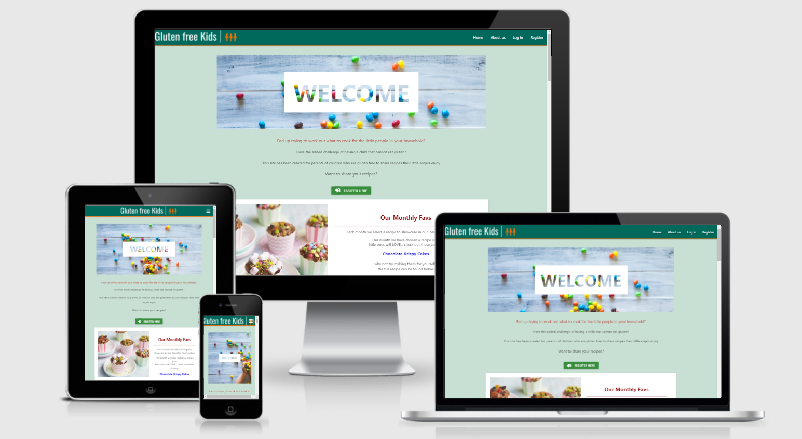

# Testing

# Table of Contents 
1. [Validation Services](#validation)
2. [Errors/Warnings HTML](#html)
3. [Errors/Warnings CSS](#css)
4. [Errors/Warnings JS Hint](#js)
5. [Errors/Warnings PEP8](#pep8)
6. [Speed Test](#speed)
7. [Testing User Experience (UX)](#ux)
8. [Manual Testing](#manual)

# Validation 

* [W3C Markup Validation Service](https://validator.w3.org/) - Used to validate html
    * As there are so many reports please find all the results [Here](static/images/testing/Html)

* [W3C CSS Validation Service](https://jigsaw.w3.org/css-validator/) - Used to validate CSS
    * style.css: [view report](static/images/testing/CSS.pdf)

* [JS Hint](https://jshint.com/) - Used to validate JavaScript
    * hmpg.js: [view report](static/images/testing/JSHint.pdf)

* [PEP8 Online Service](http://pep8online.com/) - Used to validate CSS
    * style.css: [view report](static/images/testing/PEP8.pdf)

[Back to Testing](TESTING.md)

# Errors/Warnings HTML 

I have a number of errors and warnings that I was unable to resolve as they relate directly to the Jinga templating.

These include:

The Base template threw up some issues regarding missing/stray tags but having double check I am satisfied that no tags are left open or missing. I believe this is again attributed to Jinga templating.

I am satisfied that the only remaining errors/warnings are in connected with Jinga templating so I have left unresolved.

[Back to Testing](TESTING.md)

# Errors/Warnings CSS 

My CSS was free of errors.

I had the following warning:

As this was part of the W3Schools tutorial and it was a warning as opposed to an error I have left this in place.

[Back to Testing](TESTING.md)

# Errors/Warnings JS Hint 

This report didnt highlight any errors or warnings to resolve

# Errors/Warnings PEP8 

PEP8 showed a number of errors with length, white space and indentation. 

These have all been resolved.

[Back to Testing](TESTING.md)

# Speed Test 

I used [TinyPNG](https://tinypng.com/) to reduce the size of my images to help with loading speed

I tested the website speed for mobile and desktop and recorded the results

Mobile: 

Desktop:

[Back to Testing](TESTING.md)

# Testing User Experience (UX) 

## First time user goals :

* Easily understand the purpose of the website
    * The purpose of the website is clear from the title and opening welcome statement on the homepage
    * The purpose/background to how the site came about is explained further on the about us page  
* Find info on being Gluten Free
    * There are links to external resources on the about us page 
* Register to create an account
    * Users can register for an account on the Register page
* View recipes and search recipes
    * Recipes can be viewed on the homepage 
    * There is a search function on the main page which searches category, recipe name and ingredients

## Returning/Frequent user goals:

* View recipes and search recipes
    * Recipes can be viewed on the homepage 
    * There is a search function on the main page which searches category, recipe name and ingredients
* See new recipes added by other users
    * All new recipes will be visable on the homepage
    * Recipes added by other users will be visable on the homepage
* Check out Monthy Fav recipe
    * This section is to be manually updated on a monthly basis 
    * A future consideration would be for this to update automatically
* Edit/Delete recipes added
    * Users can edit and delete their recipes from their 'My Recipes' page
* Delete user account
    * Users can delete their accounts from their 'Account Page'
    * There is a prompt to confirm they are sure they wish to delete their account

[Back to Testing](TESTING.md)

# Manual Testing 

text here

[Back to Testing](TESTING.md)